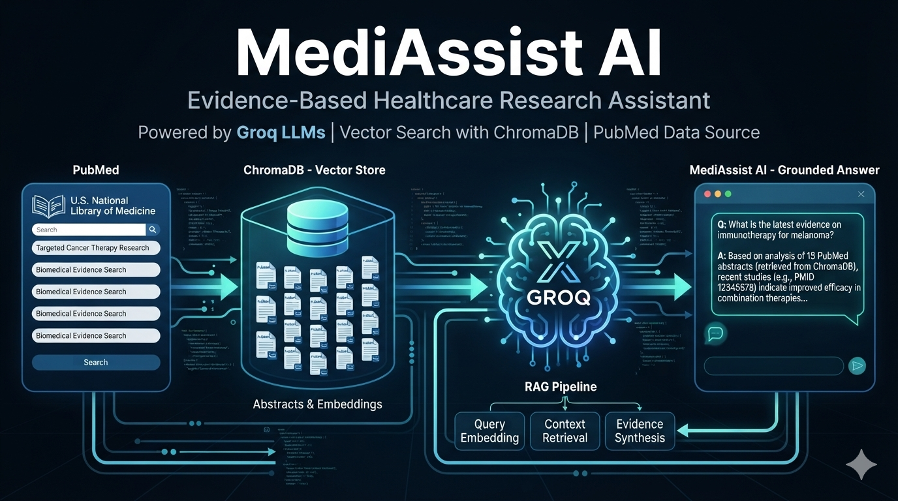
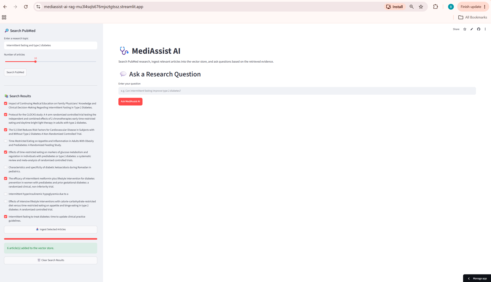
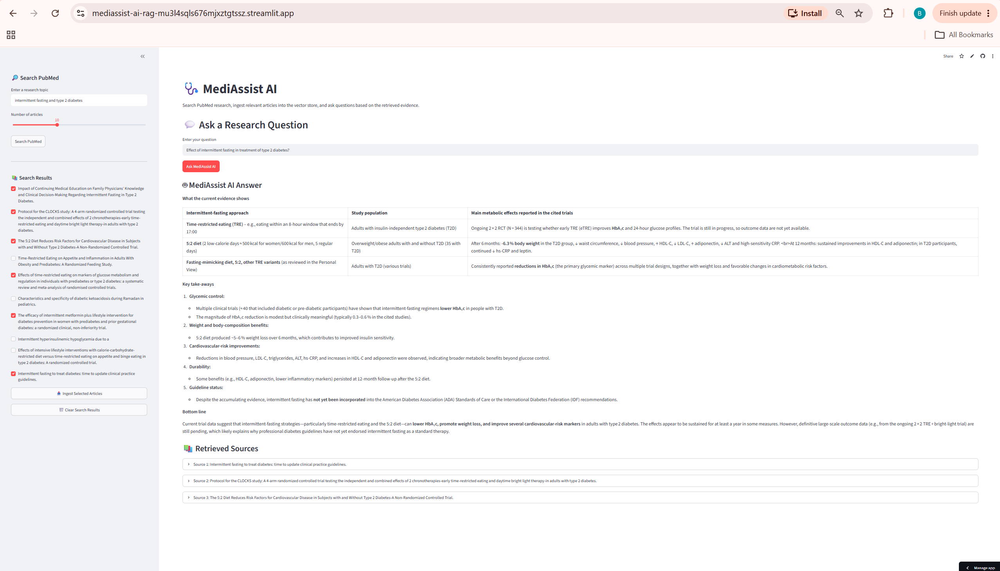
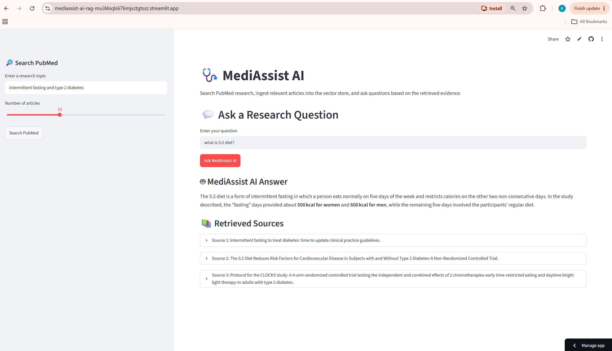
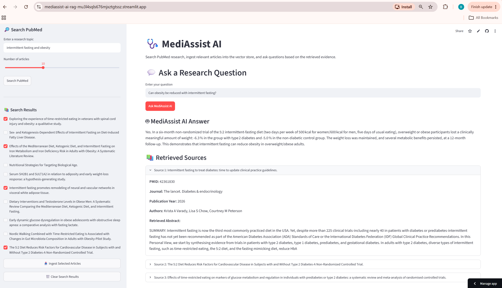

<p align="center">
  
</p>

# 🩺 MediAssist AI

### Evidence-Based Healthcare Research Assistant using RAG, PubMed, ChromaDB & Groq

<p align="center">
  <a href="https://mediassist-ai-rag-mu3l4sqls676mjxztgtssz.streamlit.app/">
    
  </a>
  <a href="https://github.com/bhartishr28/mediassist-ai-rag">
    
  </a>
  
  
  
</p>

<p align="center">
  <b>Search biomedical research → Retrieve relevant evidence → Generate grounded answers</b>
</p>

---

## 🚀 Live Demo

### [👉 Try MediAssist AI](https://mediassist-ai-rag-mu3l4sqls676mjxztgtssz.streamlit.app/)

**Source Code:**
[GitHub Repository](https://github.com/bhartishr28/mediassist-ai-rag)

> **Note:** The application is an educational and research-assistance project. It is not a medical diagnostic or clinical decision-support system.

---

# 📌 Overview

**MediAssist AI** is an AI-powered healthcare research assistant built using **Retrieval-Augmented Generation (RAG)**.

The application allows users to search **PubMed**, select relevant research articles, store their abstracts in **ChromaDB**, retrieve the most relevant evidence for a question, and generate an evidence-grounded response using a **Groq-hosted LLM**.

The project demonstrates an end-to-end Generative AI workflow that combines:

* Biomedical research retrieval
* Vector databases
* Semantic search
* Retrieval-Augmented Generation
* Large Language Models
* Prompt engineering
* Source transparency
* Interactive web application development
* Cloud deployment

---

# 🎯 Problem Statement

Healthcare professionals and research assistants often need to review large volumes of medical research to find reliable evidence for specific health-related questions. This becomes particularly challenging in areas such as **intermittent fasting (IF)**, which is being explored as a potential approach for obesity, Type 2 diabetes, and metabolic disorders.

The key challenges identified are:

* **Conflicting Evidence:** A rapidly growing body of research on intermittent fasting contains mixed, inconclusive, or varying findings.
* **Lack of Consensus:** Studies investigate different fasting approaches, such as **16:8, 5:2, and alternate-day fasting**, making it difficult to form a unified understanding of their effectiveness.
* **Information Overload:** Healthcare professionals may need to review numerous research papers and abstracts to identify relevant evidence.
* **Time Constraints:** Clinicians and research assistants have limited time to manually search, read, compare, and synthesize research findings.
* **Risk of Unsupported Answers:** Conventional generative AI systems may provide answers without directly grounding them in relevant medical research.

Traditional search engines provide a list of papers, but users still need to manually:

1. Identify relevant studies
2. Read abstracts
3. Compare findings
4. Extract important information
5. Synthesize the evidence

At the same time, asking a Large Language Model directly can produce unsupported or hallucinated information.

### Objective

The objective of **MediAssist AI** is to provide a healthcare research assistant that can **retrieve relevant biomedical literature and generate concise, evidence-grounded answers** to questions related to intermittent fasting.

The system uses **PubMed for research retrieval, ChromaDB for semantic search, and Retrieval-Augmented Generation (RAG) with a large language model** to connect user questions with relevant research evidence.

This approach aims to reduce the time required to locate and synthesize relevant research while providing users with access to the underlying sources for further review.

### The goal of MediAssist AI

Combine **information retrieval with LLM generation** so that the model receives relevant research context before generating an answer.

---

# 💡 Solution

MediAssist AI follows this workflow:

```text
                    User
                     │
                     ▼
              Search PubMed
                     │
                     ▼
             Research Articles
                     │
                     ▼
          Select Relevant Articles
                     │
                     ▼
             Store Abstracts
                     │
                     ▼
                 ChromaDB
                     │
                     ▼
             User Research Query
                     │
                     ▼
          Semantic Similarity Search
                     │
                     ▼
           Relevant Research Context
                     │
                     ▼
                 Groq LLM
                     │
                     ▼
          Evidence-Grounded Answer
                     │
                     ▼
             Retrieved Sources
```

---

# 🔄 RAG Pipeline

The application implements the following RAG pipeline:

### 1. Search

The user enters a research topic in the Streamlit interface.

Example:

```text
intermittent fasting type 2 diabetes
```

The application queries PubMed using NCBI E-utilities API.

### 2. Retrieve

PubMed returns relevant article information, including:

* PMID
* Title
* Abstract
* Journal
* Authors
* Publication year

### 3. Select

The user reviews the search results and selects relevant research articles.

### 4. Ingest

Selected abstracts are stored in ChromaDB.

### 5. Query

The user asks a natural-language research question.

Example:

```text
Can intermittent fasting improve metabolic health?
```

### 6. Retrieve Relevant Evidence

ChromaDB performs semantic retrieval and identifies the most relevant stored research abstracts.

### 7. Generate

The retrieved research is passed to the Groq-hosted LLM as context.

### 8. Answer

The model generates a concise response based on the retrieved research.

### 9. Display Sources

The application displays the retrieved research metadata and abstracts so users can inspect the evidence.

---

# ✨ Key Features

## 🔎 PubMed Search

Search biomedical literature directly from the application.

Users can specify the research topic and number of articles to retrieve.

---

## 📚 Research Article Selection

Users can review PubMed results and select only the articles relevant to their research question.

---

## 🧠 ChromaDB Vector Store

Selected research abstracts are stored in ChromaDB.

The vector database enables semantic retrieval based on the meaning of the query rather than simple keyword matching.

---

## 🔍 Semantic Retrieval

When a user asks a question, the application retrieves the most relevant research from the ingested articles.

---

## 🤖 RAG-Based Answer Generation

The retrieved research is supplied to the LLM as context.

The model is instructed to:

* Use the retrieved context
* Avoid unsupported claims
* Avoid making up information
* Indicate when retrieved evidence is insufficient
* Provide a concise research-oriented response

---

## 📖 Source Transparency

The application displays the retrieved sources along with:

* Article title
* PMID
* Journal
* Publication year
* Authors
* Retrieved abstract

This makes it possible for users to inspect the research behind the generated response.

---

# 🖥️ Application Screenshots

## PubMed Search



Search PubMed for relevant biomedical research.

---

## Research Selection



Select the articles that should be added to the knowledge base.

---

## RAG Question Answering



Ask a research question and retrieve relevant evidence from ChromaDB.

---

## Retrieved Sources



Review the research documents retrieved by the semantic search process.

---

# 🏗️ Architecture

```text
┌────────────────────────────┐
│           User             │
└─────────────┬──────────────┘
              │
              ▼
┌────────────────────────────┐
│       Streamlit UI         │
└─────────────┬──────────────┘
              │
              ▼
┌────────────────────────────┐
│        PubMed API          │
│   Search & Article Fetch    │
└─────────────┬──────────────┘
              │
              ▼
┌────────────────────────────┐
│    Selected Abstracts       │
└─────────────┬──────────────┘
              │
              ▼
┌────────────────────────────┐
│         ChromaDB            │
│ Vector Storage & Retrieval  │
└─────────────┬──────────────┘
              │
              │ Relevant Context
              ▼
┌────────────────────────────┐
│          Groq LLM          │
│      Answer Generation     │
└─────────────┬──────────────┘
              │
              ▼
┌────────────────────────────┐
│       Answer + Sources      │
└────────────────────────────┘
```

---

# 🛠️ Technology Stack

| Technology                    | Purpose                                |
| ----------------------------- | -------------------------------------- |
| **Python**                    | Core development                       |
| **Streamlit**                 | Interactive web application            |
| **PubMed / NCBI E-utilities** | Biomedical literature retrieval        |
| **ChromaDB**                  | Vector database and semantic retrieval |
| **Groq API**                  | LLM inference                          |
| **GPT-OSS 120B**              | Response generation                    |
| **Requests**                  | API communication                      |
| **python-dotenv**             | Environment variable management        |
| **Git**                       | Version control                        |
| **GitHub**                    | Source code hosting                    |
| **Streamlit Community Cloud** | Deployment                             |

---

# 📁 Project Structure

```text
mediassist-ai-rag/
│
├── main.py
├── pubmed.py
├── chroma_manager.py
├── rag.py
├── test_pubmed.py
│
├── requirements.txt
├── README.md
├── .gitignore
│
└── visuals/
    ├── cover.png
    ├── screenshot1.png
    ├── screenshot2.png
    ├── screenshot3.png
    └── screenshot4.png
```

### Core Files

| File                | Description                                                                  |
| ------------------- | ---------------------------------------------------------------------------- |
| `main.py`           | Streamlit application and user interface                                     |
| `pubmed.py`         | PubMed search and article retrieval                                          |
| `chroma_manager.py` | ChromaDB storage and semantic retrieval                                      |
| `rag.py`            | RAG prompt construction and Groq LLM interaction                             |
| `test_pubmed.py`    | PubMed functionality testing                                                 |
| `requirements.txt`  | Python dependencies                                                          |
| `.gitignore`        | Prevents secrets, local databases and environment files from being committed |

---

# ⚙️ Installation

Clone the repository:

```bash
git clone https://github.com/bhartishr28/mediassist-ai-rag.git
```

Navigate to the project:

```bash
cd mediassist-ai-rag
```

Create a virtual environment:

```bash
python -m venv .venv
```

Activate it on Windows:

```bash
.venv\Scripts\activate
```

Install dependencies:

```bash
pip install -r requirements.txt
```

---

# 🔐 Environment Variables

Create a `.env` file in the project root:

```env
GROQ_API_KEY=your_groq_api_key
```

The application reads the API key using an environment variable.

### Security

The `.env` file is excluded through `.gitignore`.

**Never commit API keys or other credentials to GitHub.**

For Streamlit Community Cloud, configure the API key through **Streamlit Secrets**.

---

# ▶️ Run Locally

Start the Streamlit application:

```bash
streamlit run main.py
```

The application will open in your browser.

---

# ☁️ Deployment

MediAssist AI is deployed using **Streamlit Community Cloud**.

```text
GitHub
   │
   ▼
Streamlit Community Cloud
   │
   ├── Install requirements.txt
   ├── Load Secrets
   └── Run main.py
            │
            ▼
       Live Application
```

### Live Application

[🚀 Launch MediAssist AI](https://mediassist-ai-rag-mu3l4sqls676mjxztgtssz.streamlit.app/)

---

# 🗄️ Why ChromaDB?

ChromaDB provides a simple vector database layer for storing and retrieving research documents based on semantic similarity.

For this portfolio project, it provides an easy way to demonstrate the core RAG retrieval workflow without introducing additional managed infrastructure.

The application uses local persistent storage:

```python
chromadb.PersistentClient(
    path="./chroma_db"
)
```

The local ChromaDB directory is intentionally excluded from GitHub because it is generated application data rather than source code.

---

# 📚 Why PubMed?

PubMed is a biomedical literature database maintained by the U.S. National Library of Medicine.

Using PubMed as the research source provides the application with a focused biomedical literature retrieval layer rather than relying on arbitrary web content.

The current implementation primarily retrieves **article metadata and abstracts**.

---

# 🤖 Why Groq?

Groq provides fast inference through an API-based LLM platform.

MediAssist AI uses a Groq-hosted **GPT-OSS 120B** model to generate responses using the research context retrieved from ChromaDB.

The LLM is therefore used primarily for **contextual synthesis and response generation**, while the retrieval layer provides the research context.

---

# ⚠️ Limitations

MediAssist AI is a **portfolio and research-assistance demonstration**, not a production healthcare system.

## 1. Abstract-Based Retrieval

The current application primarily works with PubMed abstracts.

Full-text articles are not automatically retrieved or processed.

Important information that exists only in the full paper may therefore be unavailable to the system.

---

## 2. Retrieval Depends on User Selection

The system retrieves information from articles that have been ingested into ChromaDB.

If relevant articles are not selected and ingested, the system cannot retrieve them during question answering.

---

## 3. Retrieval Quality Affects Answer Quality

The quality of the generated response depends on:

* Search query quality
* Article selection
* Research relevance
* Abstract completeness
* Semantic retrieval quality

Poor retrieval can result in a less useful answer.

---

## 4. LLMs Can Still Make Errors

RAG can reduce unsupported generation, but it does not eliminate LLM errors.

The generated answer should therefore be treated as a research summary rather than definitive medical evidence.

---

## 5. No Clinical Validation

The application has not undergone:

* Clinical validation
* Medical regulatory review
* Prospective clinical evaluation
* Formal safety evaluation

It should not be used for clinical decision-making.

---

## 6. Not a Medical Diagnostic Tool

MediAssist AI does not provide:

* Medical diagnosis
* Individualized treatment recommendations
* Medication decisions
* Emergency medical guidance
* Clinical risk decisions

Users should consult qualified healthcare professionals for medical advice.

---

## 7. ChromaDB Persistence

The deployed application uses local ChromaDB storage.

Local storage on Streamlit Community Cloud should not be treated as a reliable production database.

Application restarts, rebuilds, or deployment changes may cause locally stored vector data to be lost.

A production implementation should use a persistent managed vector database.

---

## 8. PubMed API Dependency

The application depends on PubMed and network availability.

API limitations, request limits, temporary service issues, or network failures may affect article retrieval.

---

## 9. Groq API Dependency

The application depends on the Groq API.

API availability, rate limits, account restrictions, model availability, or service interruptions may affect response generation.

---

## 10. Research Quality

PubMed contains research with varying methodologies and levels of evidence.

Studies can differ in:

* Study design
* Sample size
* Population
* Duration
* Methodology
* Statistical power
* Quality of evidence

Users should evaluate the original research rather than relying exclusively on the generated response.

---

# 🔒 Privacy & Security

The application follows basic security practices for a portfolio deployment:

* API keys are stored using environment variables or Streamlit Secrets.
* `.env` is excluded through `.gitignore`.
* Local ChromaDB files are excluded from Git.
* No patient-identifiable information should be entered into the application.
* The application is not designed to process protected health information.

---

# 🚀 Future Improvements

Potential improvements for a production-grade implementation include:

### Retrieval

* Hybrid keyword + vector search
* Metadata filtering
* Re-ranking
* Improved chunking
* Retrieval evaluation
* Query expansion

### Evidence Quality

* Study-design classification
* Evidence-quality scoring
* Systematic-review prioritization
* Clinical guideline integration
* Publication-date filtering

### RAG

* Citation-aware generation
* Source-level answer attribution
* Retrieval confidence scores
* Context compression
* Hallucination evaluation

### Infrastructure

* Managed vector database
* Persistent cloud storage
* Authentication
* API monitoring
* Rate limiting
* Logging
* Observability

### Healthcare Safety

* Human-in-the-loop review
* Clinical validation
* Medical safety evaluation
* Evidence-quality assessment
* Uncertainty detection

---

# 📊 Skills Demonstrated

This project demonstrates practical experience with:

### Generative AI

* Retrieval-Augmented Generation
* Large Language Models
* Prompt Engineering
* Context Grounding

### NLP / Information Retrieval

* Semantic Search
* Vector Retrieval
* Document Retrieval
* Research Information Extraction

### Data Science

* Data retrieval
* Data processing
* Metadata handling
* Information synthesis

### AI Engineering

* API integration
* Vector database integration
* LLM integration
* RAG pipeline development

### Software Development

* Python
* Streamlit
* Git
* GitHub
* Cloud deployment
* Environment and secret management

---

# 🎓 Portfolio Value

MediAssist AI demonstrates an end-to-end AI application workflow:

```text
External Data Source
        ↓
API Integration
        ↓
Research Retrieval
        ↓
Document Processing
        ↓
Vector Database
        ↓
Semantic Retrieval
        ↓
Context Construction
        ↓
LLM Generation
        ↓
Source Transparency
        ↓
Interactive Web Application
        ↓
Cloud Deployment
```

The project demonstrates how an LLM can be combined with an external knowledge source to build a more grounded research-assistance application.

---

# 👨‍💻 Author

**Bharti Kumari**

**Data Analytics Professional | AI/ML & Generative AI**

With a background in **banking, credit risk, financial analysis, and data analytics**, I am developing hands-on expertise in **Python, SQL, machine learning, deep learning, and Generative AI**.

MediAssist AI is a portfolio project demonstrating the practical application of **Retrieval-Augmented Generation (RAG), vector databases, LLMs, API integration, and AI application deployment** in a healthcare research use case.

### 🔗 Project Links

* **GitHub:** https://github.com/bhartishr28
* **Project Repository:** https://github.com/bhartishr28/mediassist-ai-rag
* **Live Demo:** https://mediassist-ai-rag-mu3l4sqls676mjxztgtssz.streamlit.app/

---

# ⚕️ Healthcare Disclaimer

> **Disclaimer:** MediAssist AI is an educational and research-assistance application developed as a portfolio project. It does not provide medical diagnosis, treatment recommendations, or professional medical advice. Information generated by the application may be incomplete, inaccurate, or context-dependent and should not be used for clinical decision-making. Users should consult qualified healthcare professionals and review the original research sources before making health-related decisions.

---

## ⭐ Feedback

If you find the project interesting, feel free to explore the repository and experiment with the RAG workflow.
